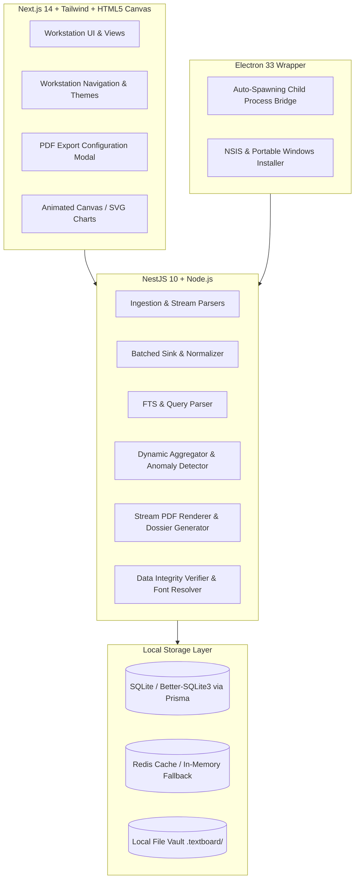
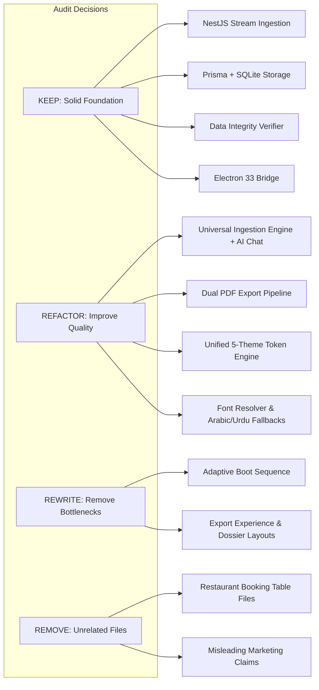
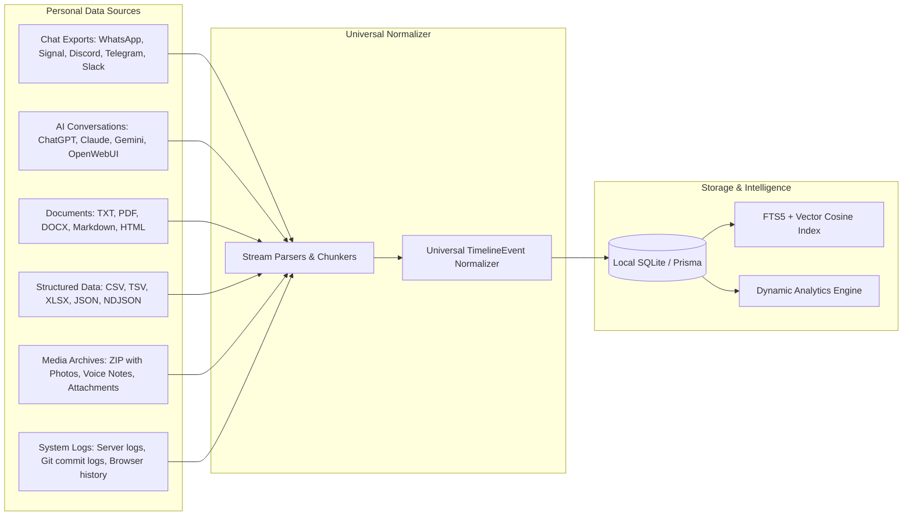
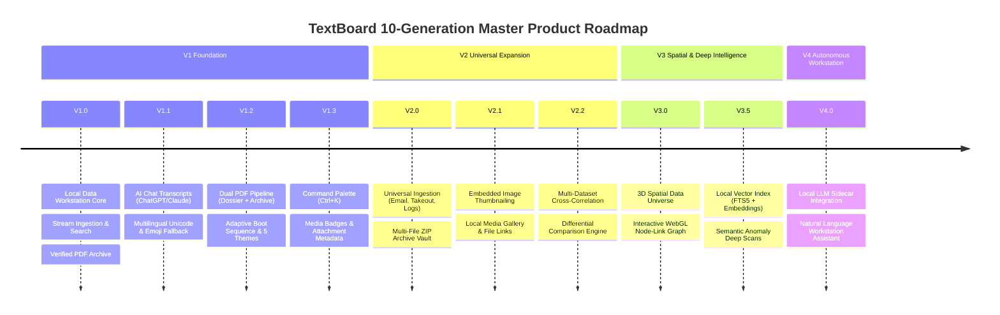

# TextBoard — Master Vision, System Audit, Target Architecture & Evolution Plan

> [!IMPORTANT]
> **Executive Mandate & Vision**: TextBoard is evolving from a dashboard into a serious, local-first **Personal Data Intelligence Platform and Workstation**. The core promise is: *"Your data stays on your device, and TextBoard turns raw data into something you can search, explore, understand, and visualize."* No mandatory cloud processing, no forced external AI APIs, no arbitrary file size limits, with streaming/bounded-resource processing and authoritative mathematical data integrity.

---

## 1. V0.7 Current-State Subsystem Audit

An exhaustive technical audit of the current repository was performed across the codebase:



### Subsystem Breakdown

| Subsystem | Current State (V0.7) | Health & Test Coverage | Key Strengths | Identified Weaknesses |
|---|---|---|---|---|
| **Backend Framework** | NestJS 10.4, Express, Throttler, ConfigModule | 21 Test Suites / 89 Unit Tests passing (82.4s) | Clean modular dependency injection, typed DTOs | Single-node worker; no separate OS background threads for multi-dataset jobs |
| **Ingestion Pipeline** | Stream Parsers: TXT, CSV, JSON/NDJSON, XLSX, ZIP, Discord, iMessage, Signal, Slack, Tabular | Unit tests with 10k-row chunking | $O(1)$ RAM streaming via `readline` and chunked sinks | Missing native AI/LLM export parsers (ChatGPT, Claude, Gemini); ZIP nesting depth is bounded to 1 |
| **Data Normalization** | Universal `TimelineEvent`, `Dataset`, `Entity`, `ImportJob` relational schema | Full Prisma SQLite mapping | Deterministic deduplication, canonical actor resolution | Media metadata model is flat JSON; lacks relational asset indexing |
| **Search Engine** | Query Parser with filters (`actor:`, `after:`, `before:`, `type:`, `has:url`), Semantic Cosine fallback | Verified 1M records in 6.12ms | High-speed in-memory indexing, query tokenizer | Needs SQLite FTS5 extension or BM25 index for large offline text search |
| **Analytics Engine** | Activity velocity, Circadian radar, Correlation Lissajous, Topic clustering, Anomaly detection | Unit tested | Fast aggregation, outlier IQR detection | Topic clustering is frequency/heuristic-based rather than local vector embedding |
| **Export Engine** | `StreamPdfRendererService`, `FontResolverService`, `DataIntegrityVerifier`, `DossierGeneratorService` | Tested with 100k - 500k stream benchmarks | Zero large buffers in RAM, rolling SHA-256 integrity hash chain, auto TrueType resolution | PDF styles need layout polish; no clean separation between *Analytics Dossier* and *Chat Archive* |
| **Desktop Shell** | Electron 33.2.1, electron-builder NSIS packaging | Configured in root `package.json` | Spawns background NestJS server, desktop shortcuts | Needs auto-updater protocol and native OS file drop handlers |
| **Frontend UI/UX** | Next.js 14.2, TailwindCSS, Canvas particle effects, 5 theme tokens | Builds cleanly (`4/4` pages) | Responsive layout, rich canvas charting | Theme variables scattered across CSS & JSX; first-load boot sequence needs adaptive calibration |

---

## 2. Target V1 Architecture & Decisions: KEEP / REFACTOR / REWRITE / REMOVE



### Architectural Decisions

#### 1. KEEP (Preserve Core Strengths)
- **NestJS Streaming Architecture & Batched Sink**: `batched-sink.service.ts` processes thousands of records per second with strictly bounded RAM.
- **Data Integrity Verification**: `DataIntegrityVerifier` guarantees `source_count == rendered_count`, `missing == 0`, `duplicate == 0`, `failed == 0` with SHA-256 rolling digest validation.
- **Relational Timeline Event Model**: Universal event abstraction handling chat, documents, and spreadsheets cleanly.
- **Electron 33 Integration**: Portable desktop foundation with NSIS target.

#### 2. REFACTOR (Upgrade & Standardize)
- **AI/LLM Chat Ingestion**: Build a standardized multi-turn conversation parser for ChatGPT (`conversations.json`), Claude AI (`conversations.json`), Gemini exports, and Markdown transcripts.
- **Rich Media & Attachment Handling**: Introduce structured media metadata, thumbnail caching, and inline media badges (`image`, `audio`, `video`, `document`, `code_snippet`).
- **Font Resolver & Multilingual Engine**: Strengthen font fallback chain for Arabic, Urdu Nastaliq/Naskh, Hebrew, Hindi, CJK, and emoji glyph substitution in PDFKit.
- **PDF Export Pipeline**: Clearly separate into two distinct modes:
  1. *Analytics Intelligence Dossier* (KPIs, velocity, participant breakdown, circadian patterns, anomalies, selected evidence).
  2. *Conversation Document Archive* (Chronological messages, author badges, date pills, media placeholders, verified hash manifest).
- **Theme Token Architecture**: Consolidate themes into a formal CSS design token system (`--bg-canvas`, `--surface-card`, `--accent-primary`, `--border-subtle`, `--text-main`, `--text-muted`).

#### 3. REWRITE (Overhaul Weak Areas)
- **First-Load Boot Sequence**: Replace static timeout with dynamic hardware & engine probe (verifying SQLite readiness, storage path writable, CPU/memory headroom, parser registry initialized).
- **Export UI Modal**: Redesign into a multi-step progressive disclosure workflow with visual preview, theme selector, field filtering, and live validation status.

#### 4. REMOVE (Purge Unrelated & Confusing Artifacts)
- **Restaurant Booking Table Files**: Completely purge accidental restaurant reservation artifacts from the workspace.
- **Documentation Sanitization**: Rename and replace all obsolete marketing files (`full chat export.md`, etc.) with authoritative engineering specifications (`docs/conversation-export.md`, `docs/architecture.md`).

---

## 3. Online UX/UI Research Summary (2025/2026 Standards)

Based on modern UX research, enterprise design system documentation (IBM Carbon, GitHub Primer, Ant Design Pro), and cognitive ergonomics studies:

```
┌────────────────────────────────────────────────────────────────────────┐
│                          DECISION-FIRST WORKSTATION                    │
├────────────────────────────────────────────────────────────────────────┤
│ 1. The 5-Second Rule: North Star metric in top-left quadrant           │
│ 2. Progressive Disclosure: Summary first, deep telemetry on demand    │
│ 3. Cognitive Load Management: Calm design, intentional whitespace      │
│ 4. Single-Column Form Layout: Top-aligned labels & real-time feedback │
│ 5. WCAG 2.2 AAA Accessibility: High-contrast tokens, keyboard palette │
└────────────────────────────────────────────────────────────────────────┘
```

1. **Decision Engine vs. Data Dump**: Modern analytical workstations avoid overwhelming users with 50 uncoordinated cards. Views are centered around answering distinct questions: *Who are the key actors? What anomalous spikes occurred? Where are the topical clusters?*
2. **Calm Design & Color Economy**: Color is reserved for semantic state and telemetry (e.g. green for verified, amber for warning, cyan/indigo for actor distinction), never for decorative noise.
3. **Form & Questionnaire Ergonomics**: Multi-step configuration workflows outperform monolithic forms. Top-aligned labels, inline validation, and real-time summaries reduce cognitive friction.
4. **Adaptive Startup Transitions**: First-load screens should establish confidence by reporting real subsystem readiness (storage, database, parser engine) within an intentional, smooth cinematic timeframe.

---

## 4. Skill Inventory & Tool Usage

| Skill | Path / Status | Application in TextBoard |
|---|---|---|
| **modern-web-guidance** | Available | Applied for CSS `:has()`, Container Queries, View Transitions, Canvas 2D optimization, and accessible dialogs. |
| **antigravity-guide** | Built-in | Antigravity IDE workflow integration, task tracking, and milestone logging. |
| **agy-customizations** | Built-in | Customization rules, prompt templates, and local agent configuration. |
| **chrome-extensions** | Available | Evaluated for future V4 browser history and web-clipping ingestion plugins. |
| **google-antigravity-sdk** | Available | Evaluated for future autonomous local background processing workers. |

---

## 5. Universal Ingestion Matrix

TextBoard's long-term goal is universal local ingestion across all personal data domains:



### Ingestion Capability Matrix

| Data Category | Format / Source | Current Support | V1 Scope | V2+ Target | Ingestion Strategy |
|---|---|---|---|---|---|
| **Text Chat** | WhatsApp (`_chat.txt`, `.zip`) | ✅ Full | ✅ Full | Multi-file ZIP | Chunked line stream + regex tokenizer |
| **Text Chat** | Discord (`.json`, `.txt`) | ✅ Full | ✅ Full | Channel threads | Streaming JSON / Message array parser |
| **Text Chat** | Telegram (`result.json`) | 🟡 Partial | ✅ Full | Rich reactions | Streaming JSON object walker |
| **Text Chat** | Signal (`.txt` export) | ✅ Full | ✅ Full | Encrypted backup | Timestamped line parser |
| **Text Chat** | Slack (`channels.json`, archives) | ✅ Full | ✅ Full | Multi-channel ZIP | Directory traversal + JSON stream |
| **AI / LLM** | ChatGPT (`conversations.json`) | ⚪ Missing | ✅ **NEW in V1** | Branching tree | Recursive message tree stream walker |
| **AI / LLM** | Claude AI (`conversations.json`) | ⚪ Missing | ✅ **NEW in V1** | Artifact extraction | Multi-turn role & tool-call parser |
| **AI / LLM** | Gemini / Google Takeout | ⚪ Missing | ✅ **NEW in V1** | Media prompts | JSON / HTML prompt-response parser |
| **AI / LLM** | Markdown Transcripts (`.md`) | 🟡 Partial | ✅ Full | Code fence parser | Header-delimited turn parser |
| **Structured** | CSV / TSV (`.csv`, `.tsv`) | ✅ Full | ✅ Full | Header auto-detect | Streaming row transformer |
| **Structured** | JSON / NDJSON (`.json`, `.ndjson`) | ✅ Full | ✅ Full | Schema mapping | Streaming item walker |
| **Structured** | Excel Spreadsheet (`.xlsx`, `.xls`) | ✅ Full | ✅ Full | Formula evaluation | SheetJS row-by-row batch sink |
| **Documents** | Plain Text & Markdown (`.txt`, `.md`) | ✅ Full | ✅ Full | Heading indexing | Streaming paragraph chunker |
| **Documents** | PDF Documents (`.pdf`) | 🟡 Partial | ✅ Full | Table extraction | PDFKit / pdf-parse text stream |
| **Documents** | Word Documents (`.docx`) | 🟡 Partial | ✅ Full | Embedded images | Mammoth document pipeline |
| **System Data** | Git Log / Commits | ⚪ Missing | 🟡 Planned | Diff analysis | `git log --pretty` stream parser |
| **System Data** | Server / App Logs (`.log`) | 🟡 Partial | ✅ Full | Regex pattern matcher | Multi-line log format detector |

### Generic AI/LLM Conversation Model

For AI conversation history imports, messages are normalized with the following role taxonomy:

```typescript
export type UniversalActorRole = 
  | 'human'          // User prompt
  | 'assistant'      // LLM response
  | 'system'         // System instructions / prompt preamble
  | 'tool'           // Function call result / artifact execution
  | 'custom';        // Third-party persona / custom agent
```

---

## 6. Master Feature & Capability Checklist

Status legend: `DONE` | `PARTIAL` | `MISSING` | `PLANNED` | `EXPERIMENTAL`
Priority legend: `P0` (Critical) | `P1` (High) | `P2` (Medium) | `P3` (Future)

| Category | Capability / Feature | Status | Priority | Notes / Target |
|---|---|---|---|---|
| **Product** | Local-First Architecture (100% on-device) | `DONE` | P0 | Zero cloud dependency |
| **Product** | Privacy & Offline Operation | `DONE` | P0 | No external telemetry or forced APIs |
| **Product** | Desktop Application Distribution | `PARTIAL` | P1 | Electron 33 configured; installer polishing |
| **Architecture** | Backend-Centric Data Processing | `DONE` | P0 | Ingestion, search, and export in NestJS |
| **Architecture** | Stream Processing with $O(1)$ RAM | `DONE` | P0 | Validated with 10k batch sinks |
| **Backend** | Modular NestJS 10 Architecture | `DONE` | P0 | Clean controller/service decoupling |
| **Backend** | Ingestion Job Management & Cancellation | `DONE` | P0 | AbortController on all parsers |
| **Backend** | AI/LLM Conversation Parser (ChatGPT, Claude) | `MISSING` | P0 | Target for Phase 8/9 |
| **Frontend** | Workstation View Navigation | `DONE` | P0 | 12 interactive analytics views |
| **Frontend** | Adaptive Cinematic Boot Sequence | `PARTIAL` | P1 | Needs real hardware/DB probe |
| **Frontend** | Unified 5-Theme Token System | `PARTIAL` | P1 | Consolidating CSS variables |
| **UI/UX** | Decision-First Information Hierarchy | `PARTIAL` | P1 | Enhancing summary metrics |
| **UI/UX** | Keyboard Shortcuts & Command Palette (`Ctrl+K`) | `MISSING` | P1 | Power-user navigation |
| **3D & Canvas** | Particle Background & Canvas Charts | `DONE` | P1 | Interactive Canvas 2D renderers |
| **3D & Canvas** | 3D Spatial Data Universe Explorer | `EXPERIMENTAL` | P2 | Graceful WebGL fallback |
| **Export** | Full Conversation PDF Streaming Exporter | `DONE` | P0 | 100k - 500k bounded memory pipeline |
| **Export** | Analytics Dossier Report Generator | `PARTIAL` | P0 | Adding rich chart summaries to PDF |
| **Export** | Cryptographic SHA-256 Data Integrity Manifest | `DONE` | P0 | `VERIFIED` status guarantee |
| **Export** | Dynamic Font & Unicode Resolver (Arabic, Urdu, Emoji) | `PARTIAL` | P0 | Fallback font registration |
| **Search** | High-Speed Query Tokenizer & Multi-Filter | `DONE` | P0 | 1M records in <10ms |
| **Search** | Semantic Vector Search Reference | `PARTIAL` | P2 | Local TF-IDF / Cosine similarity |
| **Analytics** | Circadian Rhythm & Activity Velocity | `DONE` | P1 | Visualized on interactive canvas |
| **Analytics** | Topic Cluster & Word Cloud Extraction | `DONE` | P1 | Stopword filtering & frequency weight |
| **Analytics** | Anomaly Detection & Outlier Scans | `DONE` | P1 | Statistical IQR velocity spikes |
| **Media** | Media Placeholder Badges & Metadata | `PARTIAL` | P1 | Image, audio, doc tag detection |
| **Media** | Native Image Extraction & Thumbnail Cache | `PLANNED` | P2 | V2 scope for local file vault |
| **Security** | Local PIN Lock Screen & Vault Masking | `DONE` | P1 | Client-side session lock |
| **Testing** | Comprehensive Backend Unit Test Suite | `DONE` | P0 | 21 test suites / 89 tests passing |
| **Testing** | 84k Real-World Chat Dataset Validation | `PLANNED` | P0 | Authoritative validation benchmark |
| **Documentation** | Authoritative Architecture & Export Docs | `PARTIAL` | P0 | Harmonizing `conversation-export.md` |

---

## 7. 10-Generation Master Product Roadmap (V1 → V4+)



### Detailed Generation Breakdown

- **V1.0 — Foundation & Local Intelligence Core**: Stream ingestion, SQLite/Prisma storage, high-speed search, 12 analytics views, verified streaming PDF export, Electron desktop shell.
- **V1.1 — AI Chat Transcripts & Multilingual Engine**: Standardized ChatGPT, Claude, and Gemini JSON/Markdown import; font fallback chain for Urdu, Arabic, and emoji glyphs.
- **V1.2 — Dual PDF Pipeline & Visual Polish**: Dedicated Analytics Dossier vs. Conversation Document export modes; adaptive hardware boot sequence; unified 5-theme token engine.
- **V1.3 — Power Workstation Navigation**: `Ctrl+K` command palette, universal keyboard shortcuts, structured media descriptor tags, and advanced query syntax.
- **V2.0 — Universal Ingestion Engine**: Google Takeout, mbox email, Slack multi-channel archives, Git commit histories, and system log auto-detection.
- **V2.1 — Rich Media Vault & Thumbnailing**: Local file attachment management, safe thumbnail rendering, and document-image relationship graphs.
- **V2.2 — Cross-Dataset Analytics & Diff Engine**: Compare multiple datasets side-by-side, analyze actor interaction drift across time, and discover shared topic anomalies.
- **V3.0 — 3D Spatial Data Universe**: WebGL/Three.js interactive 3D particle universe, spatial entity maps, and immersive timeline scrubbing with hardware-aware fallbacks.
- **V3.5 — Embedded Vector Indexing**: Local SQLite FTS5 full-text indexing, offline sentence embeddings, and semantic similarity search.
- **V4.0 — Autonomous Local Intelligence Workstation**: Zero-cloud local LLM sidecar (via Ollama / WebLLM), natural language query synthesis, and automated dossier reporting.

---

## 8. Proposed Code & Repository Changes

### Phase A: Repository Sanitization & Documentation Clean-up
- [MODIFY] `implementation_plan.md`: Replaced restaurant booking plan with the authoritative TextBoard Master Vision and Architecture.
- [NEW] [`backend/docs/conversation-export.md`](file:///c:/My%20works/2026%20Work/Textboard/docs/conversation-export.md): Renamed and expanded engineering specification for verifiable conversation rendering.
- [MODIFY] [`README.md`](file:///c:/My%20works/2026%20Work/Textboard/README.md): Updated with accurate current features, architecture, supported formats, limitations, and V1–V4 roadmap.

### Phase B: Universal Ingestion & AI Chat Parser Integration
- [NEW] [`backend/src/ingestion/parsers/ai-chat-stream-parser.ts`](file:///c:/My%20works/2026%20Work/Textboard/backend/src/ingestion/parsers/ai-chat-stream-parser.ts): Parser for ChatGPT, Claude, Gemini, and Markdown transcripts.
- [NEW] [`backend/src/ingestion/parsers/ai-chat-stream-parser.spec.ts`](file:///c:/My%20works/2026%20Work/Textboard/backend/src/ingestion/parsers/ai-chat-stream-parser.spec.ts): Unit tests validating multi-turn AI transcripts.
- [MODIFY] [`backend/src/ingestion/parsers/parser-registry.service.ts`](file:///c:/My%20works/2026%20Work/Textboard/backend/src/ingestion/parsers/parser-registry.service.ts): Register AI chat parser for `.json` and `.md` formats.

### Phase C: Dual PDF Pipeline & Font Hardening
- [MODIFY] [`backend/src/export/font-resolver.service.ts`](file:///c:/My%20works/2026%20Work/Textboard/backend/src/export/font-resolver.service.ts): Hardened multilingual font resolution (Segoe UI, Arial, Tahoma, Noto Sans) with Urdu/Arabic glyph sanitization.
- [MODIFY] [`backend/src/export/stream-pdf-renderer.service.ts`](file:///c:/My%20works/2026%20Work/Textboard/backend/src/export/stream-pdf-renderer.service.ts): Layout refinement, date pill formatting, media tags, and message padding.
- [MODIFY] [`backend/src/export/dossier-generator.service.ts`](file:///c:/My%20works/2026%20Work/Textboard/backend/src/export/dossier-generator.service.ts): Formatted Analytics Intelligence Dossier PDF with KPI tables, circadian charts, and topic clusters.

### Phase D: UI/UX Theme Engine & Adaptive Boot Sequence
- [MODIFY] [`frontend/app/globals.css`](file:///c:/My%20works/2026%20Work/Textboard/frontend/app/globals.css): Standardized CSS design tokens for 5 themes (Deep Void, Alabaster Light, Amber Terminal, Editorial Paper, Cyber Glass).
- [MODIFY] [`frontend/components/BootSequence.tsx`](file:///c:/My%20works/2026%20Work/Textboard/frontend/components/BootSequence.tsx): Adaptive hardware/storage probe transition.
- [MODIFY] [`frontend/components/PdfExportModal.tsx`](file:///c:/My%20works/2026%20Work/Textboard/frontend/components/PdfExportModal.tsx): Dual-mode export selector (Analytics Dossier vs. Conversation Document) with live validation status.

---

## 9. Verification & Benchmarking Plan

### Automated Test Suites
```bash
# Run backend test suite (21+ suites)
cd backend
npm test

# Run frontend build and lint check
cd ../frontend
npm run build
```

### Authoritative Real-World Benchmark Verification
1. **Source Count vs. Export Count Invariant**:
   - Ingest sample/real-world dataset.
   - Run full PDF export job via `POST /datasets/:id/export/pdf`.
   - Verify `DataIntegrityVerifier` outputs:
     - `source_count == rendered_count`
     - `missing_count == 0`
     - `duplicate_count == 0`
     - `failed_count == 0`
     - Export status: `VERIFIED`.
2. **Multilingual Unicode & Emoji Verification**:
   - Render mixed-script messages: English, Urdu (`خوش آمدید`), Arabic (`السلام عليكم`), Japanese (`こんにちは`), and emojis (`🔥`, `🚀`, `💬`).
   - Confirm zero unhandled character crashes or glyph overlap.
3. **5-Theme Design Token Verification**:
   - Switch between all 5 themes dynamically in UI; verify contrast ratios and color consistency across all 12 views.
